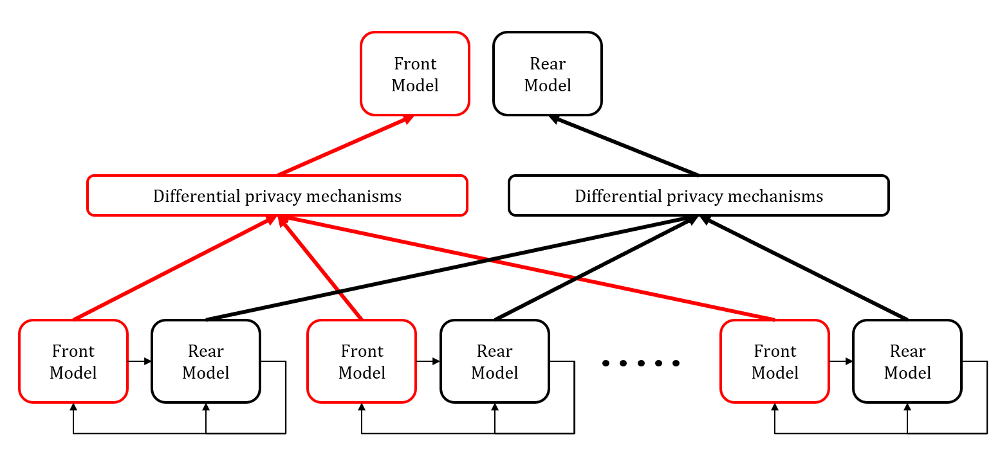

# DP-FSL

Research code that accompanies the paper **Differential Privacy-inspired Federated Split Learning for Anomaly Detection**.

## Introduction

DP-FSL is an anomaly detection method that can integrate data information from several edge log collectors in a secure manner.



<!--*Note: This repo does not include log parsing，if you need to use it, please check [logparser](https://github.com/logpai/logparser)*-->

## Major contribution
- While both federated learning and split learning can over privacy solely, we combine both to have one-level more privacy-preserving.
- While most federated learning and split learning are supervised learning, we attend anomaly detection which is not supervised.
- Different from previous methods, we add differential privacy to the aggregated part, instead of directly changing the original data, which can maximize the retention of user-side information.
- We adapt the time series model to split learning which enables our architecture to handle the task of anomaly detection.

<!--
- Modular Design

- Support multi log event features out of box

- State of the art(Including resluts from deeplog,loganomaly,robustlog...)
-->

## Local Models

| Model | Paper reference |
| :--- | :--- |
|DeepLog| [**CCS'17**] [DeepLog: Anomaly Detection and Diagnosis from System Logs through Deep Learning](https://www.cs.utah.edu/~lifeifei/papers/deeplog.pdf)|
|LogAnomaly| [**IJCAI'19**] [LogAnomaly: UnsupervisedDetectionof SequentialandQuantitativeAnomaliesinUnstructuredLogs](https://www.ijcai.org/Proceedings/2019/658)|

## Federated algorithms

| Algorithm | Paper reference |
| :--- | :--- |
|Fedavg| [**PMLR'20**] [Communication-Efficient Learning of Deep Networks from Decentralized Data](https://proceedings.mlr.press/v54/mcmahan17a/mcmahan17a.pdf)|
|FedAdam| [**ICLR'21**] [Adaptive Federated Optimization](http://www.sanjivk.com/adaptive_federated_optimization_ICLR2021.pdf)|

<!--
## Requirement

- python>=3.6
- pytorch >= 1.1.0

## Quick start

```
git clone https://github.com/donglee-afar/logdeep.git
cd logdeep
```

Example of building your own log dataset  
[SAMPLING_EXAMPLE.md](data/sampling_example/README.md)

Train & Test DeepLog example

```
cd demo
# Train
python deeplog.py train
# Test
python deeplog.py test
```

The output results, key parameters and train logs will be saved under `result/` path

## DIY your own pipeline

Here is an example of the key parameters of the loganomaly model which in `demo/loganomaly.py`  
Try to modify these parameters to build a new model!

```
# Smaple
options['sample'] = "sliding_window"
options['window_size'] = 10

# Features
options['sequentials'] = True
options['quantitatives'] = True
options['semantics'] = False

Model = loganomaly(input_size=options['input_size'],
                    hidden_size=options['hidden_size'],
                    num_layers=options['num_layers'],
                    num_keys=options['num_classes'])
```

## Benchmark results

|       |            | HDFS |     | |
| :----:|:----:|:----:|:----:|:----:|
| **Model** | **feature** | **Precision** | **Recall** | **F1** |
| DeepLog(unsupervised)| seq |0.9583 | 0.9330 | 0.9454 |
| LogAnomaly(unsupervised) | seq+quan|0.9690 |0.9825 |0.9757 |
| RobustLog(supervised)| semantic |0.9216 |0.9586 |0.9397 |
-->
## Results on HDFS 100k

|               |            |  DeepLog  |        |   |            | LogAnomaly |        |
|---------------|:----------:|:---------:|:------:|---|:----------:|:----------:|:------:|
|               | F1         | Precision | Recall |   | F1         | Precision  | Recall |
| Single Set    |   92.288   |   88.432  | 96.495 |   |   93.453   |   91.171   | 96.911 |
| Whole Set     | **95.334** |   93.159  | 97.613 |   | **94.438** |   96.325   | 96.624 |
| FedAdam       |   94.303   |   94.630  | 93.978 |   |   94.111   |   94.879   | 93.356 |
| SL+FedAdam    |   92.868   |   86.905  | 99.163 |   |   93.913   |   94.095   | 93.568 |
| DP-FSL (ours) |   92.630   |   91.654  | 94.115 |   |   93.624   |   93.030   | 96.328 |